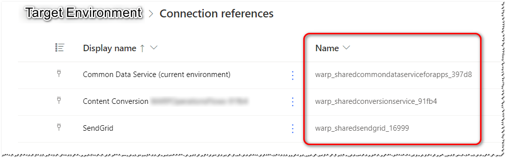

[](https://warpuk.visualstudio.com/XRMSolutionAssistant/_build/latest?definitionId=72&branchName=master)
# XRMSolutionAssistant
A .NET Standard assembly offering tooling to assist with the management of exported Microsoft CRM solution files and reducing noise in a multi-developer, branched environment.
## Available Tools
- Entity OTC Aligner
- Version Reset
- Workflow Guid Aligner
- XML Sorter
- Flow Connection Mapper
### Overview
#### Entity OTC Aligner
For versions of CRM < 9, each custom entity was assigned a code upon installation. Between different CRM Organizations, this value would be different. Even if sourced from the same solution. This tool allows the code to be set to a known value when extracted.
#### Version Reset
Many items within a CRM solution retain the version that they were initially installed with on a developer instance. To provide predictable, consistent source control files, this tool will reset this to a defined value in the Solution.xml and any other file where the ``<IntroducedVersion>`` tag is found.
#### Workflow Guid Aligner
Under some circumstances, the xaml for a Workflow may contain ``<Variable x:...>`` elements with Guids that are generated upon installation and therefore different every time the solution is extracted. This tool will replace those Guids with a predictable value.
#### XML Sorter
Due to the nature of the *SolutionPackager.exe* tool, nested elements may be written in an unpredictable order and create noise in source control change. This tool will alpha order those elements to maintain consistency across different extracts.
#### Flow Connection Mapper
Cloud Flows that are included in a solution will be extracted with connection references that are likely to be unique to the development environment. That results in the need to manually align the connections and turn on the Flows post solution import. This tool will allow you to define what the uniquename for an api connection should be and will update the customizations.xml and each Flow json to match, thereby matching connections that have been setup in the target.
## Usage
### General
All the tools are contained in the *WARP.XrmSolutionAssistant.dll* which may be called from a console application.

All the tools are in the `` WARP.SolutionAssistant `` namespace.

All the tools work on a folder structure that has been created from the *SolutionPackager.exe* console application from the CRM SDK.

Alongside the assembly is ``settings.json`` that provides information to some of the tooling.
### XRMSolutionAssistant.Console
XRMSolutionAssistant.Console is an example .NET Core console application which may be used for a quick-start and implements all the tools in the assistant assembly. The full stand-alone Windows 64-bit build is available from the releases tab [here](https://github.com/WARPTechnologiesLimited/XRMSolutionAssistant/releases). Usage:
```
WARP.XRMSolutionAssistant.Console.exe /<folder>
```
Where *folder* is the path to the extracted solution file. Folder can be either a full or relative path.

To prevent a particular tool from running, locate the ``appsettings.json`` file in the same directory as the executable and edit the `Excludes` property which is a list of names of tools that you wish to exclude from running.
```javascript
{
  "Excludes": [ "SolutionWorkflowGuidAligner", "SolutionVersionReset" ]
}
```

### Entity OTC Aligner
Modify your ``settings.json`` to contain a collection of ``EntityTypeCodes`` as below:
```javascript
{
  "EntityTypeCodes": [
    {
      "EntityLogicalName": "warp_customentity1",
      "TypeCode": 10029
    },
    {
      "EntityLogicalName": "warp_customentity2",
      "TypeCode": 10028
    }
  ]
}
```
#### Implementation
```csharp
            var entityAligner = new SolutionEntityAligner(folder);
            entityAligner.Execute();
```
### Version Reset
Modify your ``settings.json`` SolutionVersionReset member to reflect the version you want the solution components to align to.
```javascript
{
  "EntityTypeCodes": [
    {
      "EntityLogicalName": "warp_customentity",
      "TypeCode": 10145
    }
  ],
  "SolutionVersionReset": {
    "ResetVersion":  "1.0.0.0" 
  } 
}
```

#### Implementation
```csharp
            var solutionVersionResetter = new SolutionVersionReset(folder);
            solutionVersionResetter.Execute();
```
### Workflow Guid Aligner
#### Implementation
```csharp
            var workflowGuidAligner = new SolutionWorkflowGuidAligner(folder);
            workflowGuidAligner.Execute();
```
### XML Sorter
#### Implementation
```csharp
            var sorter = new SolutionXmlSorter(folder);
            sorter.Execute();
```

### Flow Connection Mapper
Modify your ``settings.json`` FlowConnectionMapper member to reflect the Connection Unique Names desired for each ApiName.
```javascript
{
  "EntityTypeCodes": [
    {
      "EntityLogicalName": "warp_customentity",
      "TypeCode": 10145
    }
  ],
  "SolutionVersionReset": {
    "ResetVersion": "0.0.0.0"
  },
  "FlowConnectionMapper": {
    "ThrowExceptionOnUnmappedConnections": false,
    "Maps": [
      {
        "ApiName": "shared_sendgrid",
        "ConnectionUniqueName": "warp_sharedsendgrid_16999"
      },
      {
        "ApiName": "shared_commondataserviceforapps",
        "ConnectionUniqueName": "warp_sharedcommondataserviceforapps_397d8"
      }
    ]
  }
}
```
To determine `ApiName`, export a Flow as JSON from the development environment. Look for the `connectionReferences` property. That will list the connection references used in the Flow. Take the `api.name` property.
```javascript
  "properties": {
    "connectionReferences": {
      "shared_sendgrid": {
        "runtimeSource": "embedded",
        "connection": {
          "connectionReferenceLogicalName": "warp_sharedsendgrid_70e47"
        },
        "api": {
          "name": "shared_sendgrid"
        }
      },
      "shared_commondataserviceforapps": {
        "runtimeSource": "embedded",
        "connection": {
          "connectionReferenceLogicalName": "new_sharedcommondataserviceforapps_b8dfb"
        },
        "api": {
          "name": "shared_commondataserviceforapps"
        }
      }
    },
    "definition": {...
```
In the above example, we have two apis that we need to map; `shared_sendgrid` and `shared_commondataserviceforapps`.

To determine the `ConnectionUniqueName`, log into PowerAutomate and locate the Connection References. The **Name** column contains the unique name of the connection. Use this value for the `ConnectionUniqueName` in the `settings.json` file. See below for example.



Set `ThrowExceptionOnUnmappedConnections` to `true` if you wish the SolutionAssistant to stop processing when an api unknown to the `settings.json` is found in the customizations.xml file. When set to `false`, a Warning is written to the Logger.

#### Implementation
```csharp
                var flowMapper = new SolutionFlowConnectionMapper(rootDirectory);
                flowMapper.Execute();
```

=======
